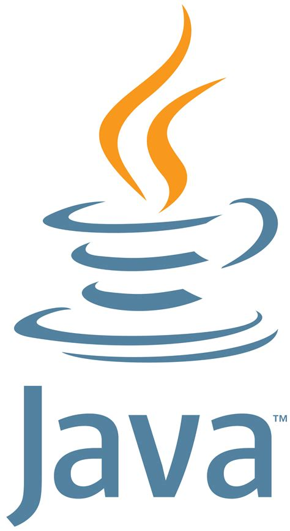

- 👋 Hi, I’m @ Eshaan Joshi
- 👀 I’m interested in analysing data, making web apps and Finance
- 📈 I want to work in the financial fields,the stock markets, a Business / Financial Analyst,etc.
- 🌱 I’m currently learning Data Science and Business Intelligence
- 💞️ I’m looking to collaborate on Data Science Applications, Dashboards and Projects
- 📫 How to reach me eshaanjoshi713@gmail.com
---
### Programming Languages
          <!---->   

### Scripting Languages
  

### Tools
     
<!---
EshaanJoshiSDBI/EshaanJoshiSDBI is a ✨ special ✨ repository because its `README.md` (this file) appears on your GitHub profile.
You can click the Preview link to take a look at your changes.
--->
